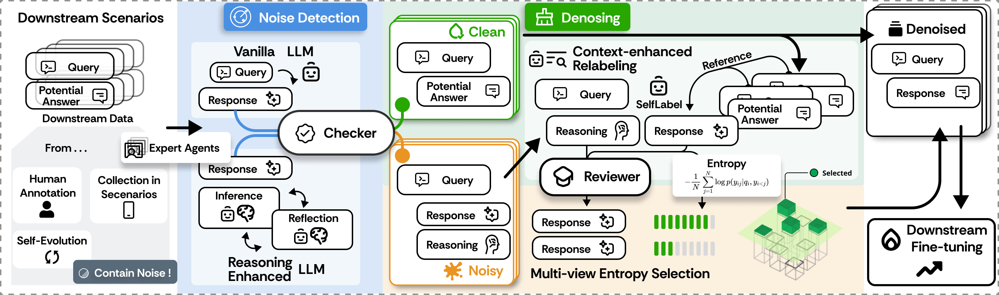

# RobustFT: Robust Supervised Fine-tuning for Large Language Models under Noisy Response

RobustFT is a noise-robust supervised fine-tuning framework designed to enhance the performance of Large Language Models (LLMs) in the presence of noisy training data. [Paper Link](https://arxiv.org/abs/2412.14922).

## Overview

Supervised fine-tuning (SFT) is essential for adapting LLMs to specific domains, but noisy training data can significantly impact model performance. RobustFT addresses this challenge through:

1. Multi-expert collaborative noise detection
2. Context-enhanced relabeling strategy
3. Response entropy-based data selection




## Project Structure

```
RobustFT/
├── data/ # Dataset directory
│ ├── arc/ # ARC dataset
│ ├── drop/ # DROP dataset
│ ├── fpb/ # FPB dataset
│ ├── mmlu/ # MMLU dataset
│ └── pubmedqa/ # PubMedQA dataset
├── utils/ # Utility functions
│ ├── batchreg.py # Batch registration utilities
│ ├── loopreg.py # Loop registration utilities
│── common.py # Common utility functions
│── config.py # Configuration settings
│── convert_data.py # Data conversion utilities
│── eval.py # Evaluation scripts
│── robustft.py # RobustFT implementation
│── rag.py # Retrieval-Augmented Generation utilities
│── self-rag.py # Self-RAG implementation
│── self-select.py # Self-selection utilities
```


## Features

- **Noise Detection**: Implements a multi-expert collaborative system with inference-enhanced models
- **Denoising**: Uses context-enhanced strategy for reliable annotation generation
- **Data Selection**: Features response entropy-based filtering for high-quality sample selection
- **Multiple Dataset Support**: Works with various datasets including ARC, DROP, FPB, MMLU, and PubMedQA

## How to use

1. Run a model using vllm, for example Llama3.1-8B
```bash
CUDA_VISIBLE_DEVICES=0 vllm serve meta-llama/Meta-Llama-3.1-8B-Instruct --port 8004
```

2. Modify the url in config.py and run robustft
```
# Modify the url in config.py
MODELS_CONFIG = {
    "llama3.1": {
        "name": "meta-llama/Meta-Llama-3.1-8B-Instruct",
        "url": "http://localhost:8004/v1",
        "method": "loop"
    }
}
```
Then run
```bash
python robustft.py --task mmlu --model llama3.1 --noise_ratio 30
```
This will generate `./data/mmlu/denoise/denoise30.csv`

3. Modify and run `convert_data.py` to get SFT data in Alpaca format

4. Use frameworks like Llama-Factory for SFT training
Here's an example using Llama-Factory:
- Modify `LLaMA-Factory/data/dataset_info.json` to add our dataset and path
- Modify `LLaMA-Factory/examples/train_lora/llama3_lora_sft.yaml` to include model, dataset, storage path, etc., keeping default training parameters
- Run SFT
```bash
CUDA_VISIBLE_DEVICES=0 llamafactory-cli train YOUR_PATH_TO_CONFIG.yaml
```

5. Start LoRA inference using VLLM
```bash
CUDA_VISIBLE_DEVICES=0 vllm serve meta-llama/Meta-Llama-3.1-8B-Instruct --enable-lora --lora-modules \
mmlu_robustft_30=YOUR_PATH_TO_SFT_MODEL \
--port 8004
```

6. Add config, modify `eval.py` and run evaluation

```python
python eval.py

```

## BibTex

If our work has been helpful to you, please consider citing it. 

```BibTex
@misc{luo2024robustft,
    title={RobustFT: Robust Supervised Fine-tuning for Large Language Models under Noisy Response}, 
    author={Junyu Luo and Xiao Luo and Kaize Ding and Jingyang Yuan and Zhiping Xiao and Ming Zhang},
    year={2024},
    eprint={2412.14922},
    archivePrefix={arXiv},
    primaryClass={cs.CL},
    url={https://arxiv.org/abs/2412.14922}, 
}
```

Also, welcome to check out our recent work [SemiEvol](https://arxiv.org/abs/2410.14745) ([Code](https://github.com/luo-junyu/SemiEvol)) on semi-supervised fine-tuning for LLM adaptation.

```BibTex
@misc{luo2024semievol,
    title={SemiEvol: Semi-supervised Fine-tuning for LLM Adaptation}, 
    author={Junyu Luo and Xiao Luo and Xiusi Chen and Zhiping Xiao and Wei Ju and Ming Zhang},
    year={2024},
    eprint={2410.14745},
    archivePrefix={arXiv},
    primaryClass={cs.CL},
    url={https://arxiv.org/abs/2410.14745}, 
}
```
